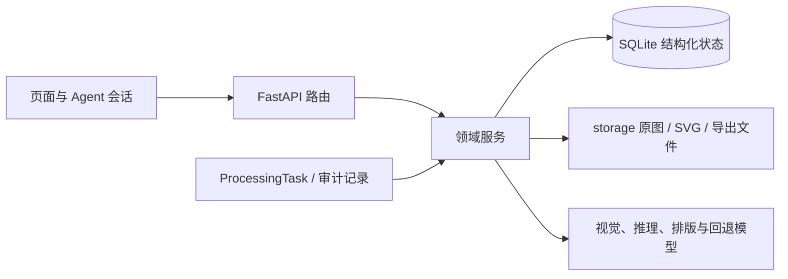

# 核心设计文档

> 本文只描述当前有效的产品边界、领域关系和设计决策。具体实现见 [Techniques.md](Techniques.md)，安装与操作见 [README.md](README.md)。

## 1. 项目定位

学习 Agent 是面向学生与教师的本地优先学习辅助系统。它把图片或文档中的题目、答案与笔记转为可检索的结构化资产，并提供解题、示意图、组卷、知识树、搜题、批改、实验图画布，以及具备语音交互与学习记忆能力的专注模式教师 Agent。

系统优先适配低资源服务器：单体 Python 服务、SQLite、本地文件存储、原生前端，不依赖 Node.js、Redis 或独立数据库服务。AI 负责理解和推理，确定性程序负责状态、校验、文件安全、布局和导出。

## 2. 核心设计原则

- 原题事实优先：OCR 文本、原图和 OCR 参考 SVG 是题意依据，解题模型不得重新想象原题图。
- 内容与展示分离：AI 输出语义结构，后端负责安全校验、排版、SVG 和持久化，前端只展示受控结果。
- 单一事实源：题目、试卷、笔记和任务分别由对应实体持有，页面内存不代替数据库状态。
- 可恢复：长任务先落盘再入队，重启后可依据持久化状态续跑；失败必须可见、可重试、可追踪。
- 自动适配：桌面和窄屏共用一套页面和数据，由容器空间决定重排，不维护独立“手机版”。
- 主题一致：业务颜色来自全局语义变量；黑白打印内容与实验图米白画布可保留固定基础色。
- 容量诚实：题量、文件数量或模型能力不足时明确降级或停止，不伪造成功结果。

## 3. 系统边界

系统分为七个领域：

1. 题目录入与 AI 解题：上传、OCR、手写信息分离、参考图、答案、得分点和审查。
2. 题库与检索批改：按学科、年级、知识点与语义查找题目，完成单题或整卷批改。
3. 组卷与导出：容量预检、AI 选题、冻结题目集合、排版审查、保存和下载。
4. 笔记与知识树：解析图片和文档、结构化、同类合并、引用题目、夜间巡检与知识树重建。
5. 图形与画布：原题流程图、数学示意图、函数图、物化实验图、组件拼装和人工校准。
6. Agent 与配置：多轮会话、工具路由、模型配置、Prompt、用户画像、首页组件、模块开关和知识检索（本地知识库优先、可联网补充）。
7. 专注模式与语音讲解：AI 分段教学、「对吧」检查点、语音输入输出、面部表情分析、虚拟海马体记忆管理。

### 3.1 系统架构与模块协作

系统采用“页面/Agent → FastAPI 路由 → 领域服务 → 持久化与文件存储”的单向调用边界。路由层只负责参数校验和响应格式；题目、上传会话、组卷、笔记、搜题批改、画布与首页布局分别由对应领域服务持有状态；AI 只通过受控服务接口读写业务数据。

跨模块引用以实体 ID 和受控文件标识为准，不允许页面内存对象成为唯一事实来源。长任务必须先写入可恢复状态，再调用模型或文件处理。

### 3.2 代码结构（单一 WEB 服务端）

系统当前只包含 WEB 服务端，按目录划分组件；早期独立的桌面端工具（`tools/` SVG Picker）已不在本项目中维护：

| 组件 | 路径 | 职责 |
|------|------|------|
| FastAPI 入口 | `backend/main.py` | 应用启动、路由注册、中间件、生命周期管理 |
| 配置管理 | `backend/config.py` | 默认设置、模块开关、路径常量 |
| 数据库模型 | `backend/models/` | SQLAlchemy ORM 模型、数据库初始化与迁移 |
| API 路由 | `backend/routers/` | 各业务领域的 HTTP 端点（题目、组卷、笔记、搜题、批改、设置等） |
| 领域服务 | `backend/services/` | 业务逻辑实现（OCR、解题、组卷、笔记、画布、专注模式等） |
| HTML 模板 | `backend/templates/` | Jinja2 模板，构成前端页面（首页、题库、组卷、笔记、画布、专注模式等） |
| 静态资源 | `backend/static/` | CSS（主题、动画）、JavaScript（全局工具、页面脚本）、图标 |
| 数据存储 | `backend/storage/` | SQLite 数据库、题目文件、试卷、笔记、会话、海马体记忆等 |

**启动方式**：`python -m uvicorn main:app --app-dir backend --host 127.0.0.1 --port 8000`

**访问方式**：浏览器打开 `http://127.0.0.1:8000`

**技术栈**：Python 3.11+、FastAPI、Uvicorn、SQLAlchemy、SQLite、Jinja2、原生 JavaScript/CSS

## 4. 数据所有权

| 实体 | 责任 | 不负责 |
|---|---|---|
| `Question` | 原图路径、OCR、题面、标答、解析、得分点、图形、标签、拍照模式/分组和处理状态 | 试卷排版 |
| 题库（题目的 `bank` 字段） | 由题目 bank 字段派生，不存在独立实体；用户"创建题库"实际上是预填上传目标题库名，等第一道题上传后题库自动可见 | 独立空题库 |
| `ProcessingTask` | 后台任务阶段、进度、错误和恢复信息 | 题目正文 |
| `UploadSession` | 整卷上传模式、本次题目集合和生成状态 | 已定稿的试卷正文 |
| `Paper` | 定稿题目顺序、卷面与答案内容、纸张和生成参数 | 重新推导题目事实 |
| `Note` | 整理后的知识内容、来源、题目引用和知识树信息 | 修改题库原题 |
| `Correction` | 作答、匹配题、得分点判定、反馈和历史 | 作为正式题库候选 |
| `SavedConfig` | 组卷配置和首页组件布局 | 复制题目或试卷正文 |
| `PromptTemplate` | 可复用提示模板及版本 | 直接替代题目事实 |
| `AgentSession` | 多轮消息、步骤和待执行动作（文件型） | 直接绕过领域服务写库 |

上传原图、参考 SVG、AI 辅助图和导出文件存放在所属实体目录中；数据库保存受控路径字段和结构化元数据。历史数据中可能存在绝对本地路径，读写时仍必须经过后端路径校验；`backups/` 是只读历史备份，不参与运行。

实体关系由后端业务规则维护：一个 `UploadSession` 可产生多个 `Question`，并可选地关联一个 `Paper`；`Paper` 保存有序题目 ID；`Correction` 可关联题目或试卷；`Note` 可引用多个题目；`ProcessingTask` 记录任一长流程。删除试卷不会级联删除题目、批改或笔记；删除上传会话也不应误删已经入库的题目，清理临时文件必须是显式、可追踪的动作。

## 5. AI 模型职责

- 视觉模型：读取图片、OCR、区分题干与手写内容、描述图形并生成忠实参考 SVG。
- 推理模型：解题、生成标准答案与得分点、选择题目、整理笔记、检查内容一致性。
- 排版审查：同时检查内容完整性与打印布局，但不能替换已冻结的题目集合。
- 轻量分类模型：判断请求类型和所需工具，减少无关上下文与推理模型调用。
- 面部表情分析：通过 Webcam 截图识别学生情绪状态（理解/困惑/走神/疲劳等），输出结构化情感报告，用于调整教学策略。
- 小米 MiMo 视觉（token plan）：`mimo-v2.5`（文本+图像）作为视觉备用链路的一环；仅当智谱不可用时参与回退，不替代 GLM 主力地位。
- 小米 MiMo 语音合成（token plan）：`mimo-v2.5-tts` 负责专注模式讲解配音，输出 base64 音频由后端代理转发；浏览器 SpeechSynthesis 永远保留为兜底引擎。
- 程序侧：校验 JSON/SVG、限制路径和资源、维护状态机、执行确定性计算与布局。

OCR 文本、视觉参考 SVG、上传的参考答案和解题结果是相互独立的证据，不存在模型天然正确的优先级。原图是最终事实依据；推理模型必须先独立检查题意和求解，再比较其他模型或来源答案，不能通过反推常量、补造条件或改图来迎合已有结论。

模型可按设置替换或回退。模型失败、响应截断、无效 JSON、无效 SVG 和审查未通过都必须记录，不能把空结果视为成功。SVG 响应只有提取到完整闭合的单个 `<svg>...</svg>` 才能进入消毒和保存；截断结果必须回退或失败，不能展示半张图。

### 5.1 Agent 决策与权限边界

Agent 先识别意图、实体和所需工具，再调用对应领域服务；它可以组合 OCR、检索、解题、质疑、组卷、笔记整理和布局工具，但不能直接修改数据库、文件路径或前端状态。只读查询可以自动执行；涉及入库、批改保存、锁定题目、定稿试卷、删除或覆盖内容的动作，必须经过服务层校验并返回可见结果。高风险质疑、低置信度匹配和容量不足不得被 Agent 静默降级为“成功”。

### 5.2 任务恢复与副作用

模型调用、文件生成和批量写入都应绑定 `ProcessingTask` 或会话步骤，保存输入摘要、当前阶段、重试次数和错误原因。重试优先复用已有 OCR 文本、参考 SVG 和题目 ID；不得因为重试而重复创建题目、重复扣分或覆盖用户已锁定内容。

### 5.3 会话管理与工具调用展示

- 空对话（无任何消息）超过 10 分钟自动清理，避免列表堆积。
- 工具调用实时展示：前端在执行步骤下方显示工具调用卡片，包含工具名称、参数、结果和执行时间，支持展开/折叠。

## 6. 题目录入流程

### 6.1 统一上传模式

题目页与整卷上传只使用一个模式字段：

| 模式 | 文件语义 | 处理结果 |
|---|---|---|
| `one_per_image` | 每张图是一道题 | 每张图各建一题 |
| `one_question_multi_image` | 多张图共同组成一道题 | 合并为一题，可调整题干、解析、答案等图片角色 |
| `auto_split` | 图片可能含多道题 | 先建容器题，再识别并生成独立子题 |

同一上传会话首次落题后锁定模式。多图一题与自动分题互斥；旧参数只做兼容映射，服务端以归一后的模式决策。

### 6.2 状态机

`staged → pending → processing → generating_solution → done | error`

- `staged`：文件已安全落盘，仍可删除或调整图片角色。
- `pending`：参数已定稿并进入队列，不再改变图片集合。
- `processing`：视觉模型提取文字、手写提示和图形事实。
- `generating_solution`：OCR 事实已持久化，开始解题、审查和生成补充图。
- `done`：题面、标答、解析、得分点和图形位置满足技术完整性约束；内容仍可带有待人工核对的质疑标记。
- `error`：保留错误摘要和重试入口，题目与任务终态必须一致。

上传会话必须逐项返回“已接受/已拒绝”结果；同一会话不能重复启动正在运行、已完成或已锁定的题目。旧数据出现“已锁定但仍是 pending”等矛盾状态时按需处理项显示，不再伪装成持续运行。重试优先复用已存 OCR 与参考 SVG。只有 `done` 题目可以锁定为已解决，锁定后自动流程不再覆盖，但用户仍可手动修订。

详细解析与得分点是两个独立字段。模型返回兼容分隔标记时由后端拆分；模型已经分别返回两者时不得因兼容逻辑丢弃详细解析。前端编辑以字段是否出现在请求中判断更新，允许显式清空错误内容。

### 6.3 OCR 参考 SVG

带图题先由视觉模型按原图生成黑白、可缩放、语义忠实的 `reference.svg`，再把 OCR 文本、图形描述和该 SVG 交给解题模型。参考图必须保持点名、方向、拓扑、相对长短、角度、虚实线、箭头、坐标或装置连接关系。

参考图状态为 `pending / ready / not_required / failed`。`failed` 不等于无图；失败时保留原图、OCR 和错误，可降级解题但不得生成另一张题面图掩盖问题。

题面参考图固定占位 `[[DIAGRAM:0]]`。参考图是第 0 张、位置为题面；解题模型只能追加用于推导的答案图，不能覆盖参考图。

### 6.4 题目质疑与证据分级

解题、自检和独立验证均返回结构化 `question_challenge`。程序只接受 `none / low / high` 三档，并限制置信度、问题类型、理由和证据长度：

- `none`：未发现有具体证据支持的实质问题。
- `low`：OCR 字符、单位、图形细节或常见约定存在小概率歧义；允许列明 `assumptions` 后给出条件化解答，同时提醒核对原图。
- `high`：条件矛盾、关键条件缺失导致不唯一、无解、图文核心关系冲突、选项全错，或独立推导明确否定上传参考答案。不得通过改写题目把它强行变成可解题。

自动流程不能仅凭一次普通高风险输出就升级：两次独立阶段均判断为 high，或单次置信度至少 0.9，才形成 high；未得到充分确认的高风险意见降为 low 展示。用户可在题目详情手动触发独立质疑；该操作只更新审查标记，不改写题干和答案。

未人工确认的 high 题保持可查看、可编辑，但暂停进入自动组卷、正式搜题候选和批改依据，也不会被夜间 AI 自动改题。用户核对原图并锁定为已解决后，视为人工确认，可恢复下游使用。

### 6.5 跨实体状态与恢复

以下是设计层的统一状态语义；当前部分实体仍以字段组合表示状态，不能把这些状态名误认为已经全部落成数据库枚举：

- `UploadSession`：`staged → processing → ready → paper_linked`，异常进入 `attention/error`；未生成试卷的整卷上传仍必须显示在试卷列表的待处理区域。
- `Paper`：`draft → generating → reviewing → finalized`；生成失败保留草稿和错误，不产生可下载假试卷。
- `Note`：`uploaded → extracting → structured → reviewed/merged`，结构化失败不得覆盖原始材料。
- `Correction`：`staged → ocr → matching → grading → saved`；匹配或评分不确定时进入人工复核。
- `AgentSession`：`created → classifying → executing → waiting_user/complete/error`；等待用户确认不是失败，也不能自动继续执行高影响动作。

## 7. 组卷流程

`需求归一 → 容量预检 → AI 返回明确题目 ID → 冻结集合与顺序 → 生成卷面和答案 → 排版审查 → 定稿 → 保存/导出`

- 明确题量或固定题集超过可用容量时必须停止并返回“需要/可用”数量，禁止静默缩减、重复题目或让 AI 补造题目。
- 只有用户选择“AI 自主决定题量”时，选题模型才可在服务端候选集合内决定实际数量；定稿后仍须完整冻结并逐项校验。
- “重新组卷”重新选择题目；“重新排版”保持题目集合，只调整布局。
- AI 选题阶段不能看到标准答案，避免答案泄漏到卷面。
- 未人工确认的 high 质疑题不计入可用容量，也不能进入自动或固定题集。
- 每个冻结题目在卷面中携带稳定的 `data-question-id`，定稿前校验所有 ID 恰好出现一次；缺失或重复时自动重试，仍失败则不落库。
- 排版 AI 只负责卷面布局，答案页由题库中的标准答案、得分点和详细解析确定性生成，不能用模型临时重解覆盖已审核答案。
- A3/A4 与试卷/答案/合并下载使用同一份定稿内容，导出失败不写入伪路径；试卷详情页支持按需勾选多份下载（试卷/答案/得分点/答题卡），后端每份独立下载，前端按 `试卷→答案→得分点→答题卡` 顺序依次 `window.open` 并 toast 提示已下载份数；`mode=answer_card` 优先读 `paper_dir/answer_card.html`，缺失时运行时按题序合成答题区。

## 8. 笔记与知识树流程

`上传图片/文本/Markdown/Word/PDF → 内容提取 → 统一结构化 → 学科校验 → 同类合并或新建 → 引用题目 → 重建知识树`

原笔记和来源必须可追溯。来源图片保存为笔记目录中的文件，数据库只存本地受控 URL，不长期保存超大 Base64。长材料用于分类时可以截取模型上下文，但整理后的正文必须附带完整原始材料，不能因模型上下文上限静默丢内容。合并只发生在同学科且知识点足够接近的内容之间，并保留来源图片、典型题、题目引用、参考资料与图形信息；自动整理结果不确定时保留审查标记。夜间巡检用于标签统一、重复内容处理、重点题与未通过审查内容复核，不绕过用户锁定。

## 9. 搜题与批改流程

拍照搜题与拍照检查共用三种范围语义，三种模式都允许多图，并保留上传顺序：

| 范围 | 多图语义 | 搜题 | 检查 |
|---|---|---|---|
| `single_question` | 多张图共同描述一道题/一份作答 | 合并 OCR 后只搜索一次 | 合并 OCR 后匹配并批改一次 |
| `single_page` | 一页全图或同页的局部补充图 | 拆成独立题目后逐题搜索 | 拆题后逐题匹配、批改并汇总 |
| `whole_paper` | 按页码排列的整卷照片 | 拆成整卷题目并逐题搜索 | 必须先选择已生成试卷，再按冻结题序和得分点批改 |

`选择范围 → 多图上传 → 临时 OCR → 按范围拆题 → 正式题库匹配 → 置信度门槛 → 得分点批改 → 保存历史`

临时 OCR 记录不得进入正式题库候选池。未人工确认的 high 质疑题不得作为搜题候选或批改标准。匹配低于阈值时要求用户指定题目或明确表示未匹配，不能猜测。整卷作答优先按语义和题号分段，题号规则仅作兜底，禁止按字符长度等分。

整卷上传记录与已生成试卷属于不同生命周期：未生成的 `UploadSession` 必须以“整卷上传”记录显示在试卷库，并标明待上传、处理中、待生成或需处理；生成 `Paper` 后只保留一个可使用的试卷条目，不能因只查询 `papers` 表而让上传数据消失，也不能把未生成记录伪装成可下载试卷。

批改以标准得分点为主，同时允许 AI 识别等价且正确的新颖解法；无法确认的判定应标记给用户，不自动覆盖标准答案。程序侧必须把各得分点限制在 `0..max_score`，拒绝 NaN、负分和超上限分数，并由归一后的得分点重算总分。整卷中的未作答题也要进入总分分母并明确标记，不能因空答案被跳过。

## 10. 结构梳理图与图形展示

结构梳理图使用稳定的 `nodes + edges` 协议，AI 只表达条件、步骤和结论关系，后端完成分层、去环、同层排序、重叠消解、跨层边路由和 viewBox 计算。有效跨层边不能为了树形外观被删除。

视觉语言以参考图为准：轻量矩形文本块、正交连线、开口箭头和充足留白。节点语义色从全局主题变量派生，黑白打印基础色除外。

展示状态只有一套 `scale/x/y`：初次打开和容器变化自动适应；桌面支持滚轮、拖拽和双击适应；触屏支持单指平移、双指缩放。超宽或超高流程图允许缩小到完整可见，再由用户局部放大。

## 11. 实验图与数学画布

画布采用 SVG 组件拼装而非位图生成。组件包含类型、尺寸、渲染器、端口和层级；语义规则将场景映射为可选择的连接方案。端口对齐、组合锁定、比例联动、液面、旋转和校准由确定性逻辑处理。

数学函数和坐标图优先使用结构化表达式与程序采样；通用几何可使用 AI 输出的受控 SVG；物化实验图优先复用组件库和模板。所有模型 SVG 均须消毒、尺寸限制和路径白名单校验。

编辑器保留桌面高密度工作流，同时自动适应窄窗口；触屏事件复用同一状态机。撤销/重做必须同时保存组件和关联关系，不能只恢复主数组。

编辑器提供图库保存、加载与删除，语义组合摆法与完整场景库浏览（含按关键词搜索场景和连接安全检查），并支持让 AI 在已加载的题目图上插入新元件或标注。题目示意图与元件 spec 只通过专用 API 加载（返回受控 spec 与新鲜度），前端不得猜测服务端静态路径。

## 12. 专注模式与语音讲解

### 12.1 产品定位

专注模式是一个独立的 Teacher Agent 页面（`/focus`），核心职责是像一个真人老师那样：把知识拆成学生能消化的小段，讲完一段就停下来确认学生状态，再决定下一段怎么讲、讲什么。

### 12.2 教学流程

`用户选择主题/题目 → AI 生成第一段讲解 → 末尾输出「对吧」检查点 → 系统采集学生状态（语音 + 表情） → 生成情感状态报告 → AI 根据状态决定下一段内容 → 循环直至完成 → 保存学习记录到海马体`

状态流转：`preparing → teaching → checkpoint → analyzing → adjusting → teaching → ... → completed | paused | abandoned`

### 12.3 检查点机制

- 每次 AI 讲解段落的末尾必须输出「对吧」作为固定检查点标记。
- 检查点触发三个并行采集动作：语音输入（Web Speech API 捕获学生回答）、表情采集（Webcam 截图）、语音情感（分析回答的语速和语调特征，由前端提取基础特征后与表情分析结果合并）。
- 采集结果合并为一份「学生状态报告」，包含：语音转文字内容、表情分析结论（理解/困惑/走神/疲劳/情绪积极/消极等）、综合置信度。
- AI 根据状态报告决定：继续下一段、换一种方式重述当前段、插入练习题、暂停休息、或结束本主题。

### 12.4 教学内容来源

- **主题模式**：用户输入一个主题（如「二次函数最值」），AI 从头生成结构化教学内容，包含概念讲解、示例推导、易错点提示。
- **题目模式**：用户从题库选择一道题，AI 基于该题的知识点展开讲解，可引用该题的解析、得分点和相关笔记。
- **混合模式**：用户输入主题，AI 从题库中选取相关题目作为例题融入讲解。

### 12.5 语音交互

- **语音识别**：前端使用浏览器 Web Speech API 将学生语音转为文字，支持中文。
- **语音合成**：双引擎设计。优先使用后端代理的小米 TTS（`/api/tts`，`mimo-v2.5-tts` 模型返回 base64 音频）；任何失败（未配置 Key、模块关闭、网络或上游错误）自动回退浏览器 SpeechSynthesis。配音可在设置页选择引擎（跟随配置 / 仅浏览器 / 优先小米）与音色。
- **停止语义**：暂停、结束、重置会话必须同时中断进行中的配音请求与音频播放，与检查点定时器的取消纪律一致。
- **语音情感**：前端提取基础语音特征（语速、音量、停顿），与表情分析结果合并为综合情感报告。

### 12.6 模块开关

专注模式受 `ENABLE_FOCUS_MODE` 模块开关控制；小米 TTS 受 `ENABLE_XIAOMI_TTS` 控制，开关关闭时 `/api/tts` 端点不注册、设置页隐藏小米卡片与引擎选项、讲解回退浏览器合成。两者关闭时均隐藏入口，已保存的设置数据保留但不可新增调用。

### 12.7 虚拟海马体记忆系统

虚拟海马体是专注模式的持久化记忆组件，负责「认识学生」和「管理对学生认识的生命周期」。它扩展现有的用户画像系统（`user_profile.py`），增加学习专属记忆区域。

**两大区域：**

1. **加载区（认识学生）**
   - 存储每个学习主题的掌握度、薄弱点、学习时长、检查点通过率。
   - 记录学生的学习偏好（喜欢哪种讲解方式、何时容易走神、最佳学习时段）。
   - 跨主题的元认知能力评估（理解力、记忆力、专注力基线）。
   - 每次教学会话开始时自动加载，作为 AI 教学策略的输入。

2. **操作区（淡化与遗忘）**
   - **时间衰减**：掌握度按指数衰减公式随时间降低，衰减速率因主题难度和用户基线而异。
   - **冲突检测**：当新学习与旧记忆存在知识冲突时，AI 可标记冲突并在对话中确认后删除或修正旧记忆。
   - **AI 自主编辑**：AI 在对话过程中可主动新增、修改或删除记忆条目（如发现学生已掌握某知识点，可直接提升掌握度；发现过时或不准确的记忆可直接删除）。
   - **淡化阈值**：掌握度低于淡化阈值的记忆标记为「久远记忆」，不再主动引用但保留数据。
   - **遗忘阈值**：掌握度低于遗忘阈值且超过最长保留期的记忆彻底删除，释放存储。

**存储格式**：每个用户一个 JSON 文件（`storage/hippocampus/profile.json`），结构化为 `{topics: {}, meta: {}, version: N}`。原子写入防止损坏。

### 12.8 黑板板书系统

专注模式为 AI 教师提供一块黑板：讲解时同步板书（文字推导 + 图形），学生只看不写（移动端手写体验差，且双向白板的输入通道会显著增加复杂度）。

- **板书页模型**：板书以"页"为单位，页内条目按书写顺序流式排列（不使用自由坐标定位）。条目两种：粉笔风格文本块（Markdown + LaTeX）和图形（白底卡片贴于板面）。
- **AI 空间管理**：AI 通过结构化指令书写（追加文字/图形）、擦除（删条目/清页）、翻页（开新页）。Prompt 中始终告知当前页容量占用；页满时由系统兜底自动开新页，保证书写不丢失。执行结果摘要回传给 AI，供下一段决策（擦旧写新或翻页）。
- **图形来源分级**：函数/坐标系图优先走结构化 spec 的确定性渲染（精确、廉价）；复杂示意图由 AI 生成单个 SVG 兜底（每段限一张，控制耗时）。所有图形必须经消毒与完整性检查；失败时降级为诚实的文字说明，不伪造图形。
- **回看**：板书页永久保留，学生可翻阅整个课堂的板书历史。AI 在关键节点主动保存"回看快照"（带标签的页引用，如"标准形式推导完成"）；学生也可手动保存当前页快照。快照是引用记录而非位图导出；PNG 导出列为未来可选。
- **开关与降级**：受 `ENABLE_FOCUS_BLACKBOARD` 控制，关闭时前端不渲染黑板、AI 输出不含板书指令。AI 输出解析失败时整体降级为纯文本讲解，板书留空，不影响教学流程。

## 13. 首页、主题与响应式界面

- 首页组件由服务端注册表提供，保存值只含去重后的组件 ID 顺序。
- 配置中的未知项、关闭模块项会被过滤；用户明确保存空布局时保持为空，恢复默认是独立操作。
- 组件选择、删除、移动、拖拽和保存操作同一份临时顺序，保存后采用服务端归一结果。
- 网格按父容器自动分列，组件少时不拉伸成超宽卡片。
- 桌面默认保留侧栏和信息密度；窄屏仅重排和折叠导航，不复制页面或功能；侧栏 CSS 默认 `left:0` 静态显示（无 JS 兜底），`<html class="js-side-nav">` 守卫由 base.html 同步 IIFE 设置；JS 启动后 IIFE 按视宽与 `localStorage.sb_user_closed` 决定是否打开并同步 `body.sb-closed` 与 `aria-expanded`。
- 页面尺寸使用 flex/grid、`minmax()`、`clamp()` 和容器查询连续适配；只有导航结构使用视口断点。
- 所有业务状态色引用全局主题变量，自定义强调色应同步影响按钮、提示、节点和动态 HTML。
- 动画遵循 `prefers-reduced-motion`，请求、弹窗、表单和页面切换使用统一反馈。
- 关闭按钮统一使用 `<svg>` 关闭图标（`window._closeIconSvg`），不出现 `&times;` 或 EMOJI；全部带 `aria-label="关闭"`。
- 输入框统一 16px 防 iOS 缩放（含 `time/date/datetime-local/month/week/url`），覆盖 768px 与 769~1024 iPad 横屏两段断点。
- 移动端 `.modal` 顶部留 `padding-top:max(14px,env(safe-area-inset-top))`，避免刘海屏遮挡。

### 13.1 前端分层架构

前端采用三层分离：CSS 设计系统、全局 JS 基础设施和页面脚本。

- **CSS 设计系统**：`theme.css` 定义全局变量、基础组件和增强组件（含原 `enhanced-ui.css` 已合并的增强组件）；`animations.css` 独立维护动画层（依赖 JS 武装机制，无 JS 时内容默认可见）。`base.html` 不再内联组件 CSS，只保留主题色注入和 FOUC 防闪烁等必须在首屏内联的脚本。
- **设计 token**：间距（`--sp-1` 至 `--sp-6`）、字号（`--fs-xs` 至 `--fs-2xl`）和圆角（`--r-sm` 至 `--r-2xl`）使用统一刻度，页面不得使用散落的魔法数字。
- **全局 JS**：`app.js` 提供 `$API`、`$toast`、`$confirm`、`$prompt`、`$md`、`$esc`、`$fmt`、`$status`、`$busy`、主题切换、交互协调器，以及全局聊天面板（`toggleGlobalChat`/`sendGlobalChat`，含 `jump_paper`/`tool_need` action 渲染）。页面脚本只负责页面业务逻辑，不重复定义全局工具。
- **公共组件类**：上传区、拍照范围选择器、评分环、得分点卡片、结果容器、表单提示行和空状态等跨页面复用组件，统一在 CSS 中定义，页面通过 class 引用而非内联样式。
- **页面脚本纪律**：内联 `<script>` 只包含当前页面的业务逻辑；所有页面共享的工具函数由 `app.js` 提供；大型编辑器脚本独立为 `.js` 文件。
- **初始化时序**：`app.js` 以 defer 加载，页面脚本只定义函数与事件绑定；所有需要 `$API` 的初始数据加载统一挂在 `DOMContentLoaded` 之后执行，禁止在 defer 脚本就绪前发起请求。

### 13.2 离线增强与本地队列（`ENABLE_OFFLINE_CACHE`）

网页端提供"离线可看、联网自动上传"的能力，不依赖 Service Worker（服务器以 `http://IP` 形式访问，浏览器安全上下文限制使 SW 不可用；有 HTTPS 域名后可升级为 SW 方案，记录于 FUTURE）。

- **分层位置**：离线层实现在 `$API` 请求封装（`offline.js` + IndexedDB），页面脚本无感知。
- **只读缓存**：白名单内的 GET 响应（题库/试卷/笔记/仪表盘等）成功后写入本地缓存；离线时同 URL 请求返回缓存并明确标记"离线数据"。缓存按时间近因清理，不缓存写操作结果和隐私临时记录。
- **上传队列**：白名单内的上传/提交类请求在离线时进入本地队列（表单字段与文件一并落盘），恢复联网后按序自动重放；重放结果通知用户，多次失败保留待手动重试。写操作的结果一律以服务器处理为准，本地不做任何 AI 推理或业务处理。
- **诚实降级**：非白名单写操作在离线时明确提示失败，不伪装成功；离线数据在 UI 上可辨识。
- **安装形态**：提供 manifest 使手机浏览器可"添加到主屏幕"（图标/名称/独立窗口形态）。

## 14. 安全与失败边界

- 上传同时校验 MIME、扩展名、文件签名、空文件、大小和批量数量。
- 题目 ID、配置 ID、文件 URL 和磁盘路径均使用白名单，不接受外部 URL 或任意路径。
- SVG 禁止脚本、事件、外部资源、动画、未知标签和危险协议，并限制长度与 viewBox。
- 动态 HTML、错误文本、标题和用户内容必须转义或经过格式白名单。
- 设置导入只接受已知键；API Key 只返回掩码，不写入文档或普通日志。
- 同一题并发处理必须串行化；JSON 与配置写入使用原子替换。
- 数据库迁移先检查列存在性并记录结果，禁止静默吞掉失败。
- SQLite 连接必须启用外键约束；启动时只修复可无损恢复的历史孤立引用，无法安全修复的迁移直接阻止服务启动。
- `storage/` 是服务端数据根目录而不是公开静态目录。浏览器只可读取白名单内的题目原图、受控 SVG、笔记来源图和前端依赖；数据库、日志、会话、配置、任务状态及其他 JSON 永不通过静态路径暴露。搜题与批改的学生作答临时记录（`search_query`/`correction_query`）即使文件位于题目目录，也不得经公开静态路径读取。

## 15. 当前限制

- OCR 参考 SVG 是结构化复刻，不是逐像素描摹，原始图片仍是最终核对依据。
- 自动分题当前可能复用整页原图，参考图阶段依赖子题 OCR 限定范围，尚无通用区域坐标裁剪。
- 单页和整卷搜题依赖 OCR 文本顺序与语义拆题；页码、题号或拍摄顺序不清时需要人工切换题目核对。
- 真实 SVG 组件中的内嵌液面不一定支持动态液体参数。
- 尺规作图已有基础组件，完整的步骤 JSON 与多帧状态机尚未实现。
- 双指手势已实现统一状态机，但仍需要持续做真实设备回归。
- 专注模式的语音情感分析当前仅依赖前端基础特征（语速、音量、停顿），未集成专用语音情感模型。
- 专注模式的表情分析依赖 GLM-4V-Flash，每次「对吧」均触发一次 API 调用，成本较高，后续可降级为本地轻量模型。
- 虚拟海马体的遗忘策略基于固定阈值和衰减公式，尚未实现基于记忆网络图结构的智能遗忘。

补充限制：当前默认是本地单用户系统，尚未承诺多用户权限、跨设备同步和并发写入隔离；临时搜题、批改和上传产物的自动清理策略仍不完整；题目、试卷、笔记之间的关系主要由服务层和 JSON 字段维护，尚未形成完整的外键级联与迁移体系；AI 供应商限流、超时、模型能力差异和无效输出仍可能使任务进入人工复核，回退不等于结果正确；真正的桌面与约 390px 窄窗口交互回归仍是验收前检查项，不能仅以静态 CSS 或单元测试替代。

## 16. 接口与端口完整性

系统对每个暴露的 HTTP 路由和前端调用的 `/api/*` 路径实行“有口必有码”：

- 任何已注册的 API 路由都必须有真实实现；禁止出现空函数、`pass` 占位、未实现说明或返回空壳的端点。
- 前端模板与静态 JS 中引用的 `/api/*` 路径必须能在后端路由表中精确匹配；动态路径参数使用统一 ID 白名单，防止静态子路径被动态段吞掉。
- 同前缀下静态路径先于动态路径注册；新增端点后必须复查路由顺序。
- 模块开关关闭时，对应页面入口、导航、首页组件和 API 调用必须一起隐藏；服务端仍保留实现但返回明确的“未启用”错误。
- 每个路由都要覆盖参数边界（长度、数量、枚举、数值范围、非法 ID）并返回 4xx，不得以 500 或空数据冒充成功。
- AI 依赖型端点必须支持测试期能力替换（monkeypatch/fake），验证状态流转、持久化与错误路径，不因外部模型不可用而中断全部验收。
- AI 模型未配置、认证失败或上游不可用统一映射为 502/503 并写 `Err.log`；只有确定性程序的内部故障才允许 500，且响应只返回稳定提示。
- AI 意图返回的 `data` 必须归一为对象；空数组、`null`、非对象结构不得让后续字段读取触发运行时错误。
- 所有 pending/临时文件读写、目录删除、主图复制和下载文件名都必须经过 ID 白名单、`realpath/commonpath` 边界校验或响应头清洗，禁止把 URL 参数直接拼入文件路径。
- 测试隔离以 `config.STORAGE_DIR / SETTINGS_FILE / GALLERY_DIR` 为唯一来源；服务层不得再按 `__file__` 自行推导数据目录，避免端点测试污染真实数据。
- 文件型数据的读取必须有对应端口：题目示意图/spec、校准、图库预设、知识库文档等都通过专用 API 访问，前端不得猜测静态目录布局；JSON 一律不通过 `/storage` 静态路径暴露。
- AI 返回的合法 JSON 但非对象（数组/字符串/数字/null）、非字符串字段与超出范围的数值（含 NaN/Inf）必须在持久化或读取前归一、拒绝或回退，不得触发运行时错误；渲染参数（liquid/angle 等）在归一化层统一数值化。
- 用户输入进入 SQL LIKE/ILIKE 时必须转义 `% _ \`；模板占位符替换必须避免已插入内容被二次替换。
- 学生作答与搜题临时记录属于隐私数据，即使存放在题目目录下也不得通过公开静态路径读取。

## 17. 文档边界

- `Design.md`：当前产品与架构决策，不保存按日期堆叠的更新记录。
- `Techniques.md`：当前实现方法、边界和验证方式，不保存操作教程或逐轮故障流水。
- `README.md`：唯一安装、启动和操作说明。
- `Fact.md`、`FUTURE.md`、`FreqErr.md`：分别保存用户约束、未实现需求和可复用错误模式。
- `done.md`：仅保存最近一轮的完成结果，不保留长期历史。
- 除此以外不存在其他项目文档或历史归档目录；`AGENTS.txt`/`AGENT.txt` 类文件是 Agent 系统指令，不属于项目文档体系。

## 18. API 端点完整性检查

为确保前端与后端的 API 接口一致性，需要定期执行端点完整性检查：

1. **前端 API 调用面扫描**：从 `backend/templates/**/*.html` 和 `backend/static/js/*.js` 中提取所有 `/api/*` 路径引用。
2. **后端路由表比对**：与 FastAPI 应用的实际路由表比对，识别缺失或不匹配的端点。
3. **端点功能验证**：确保每个 API 端点都有真实实现，禁止空函数或占位实现。
4. **模块开关一致性**：当模块开关关闭时，对应的 API 端点应返回明确的"未启用"错误，而不是 404 或 500。

此检查应作为系统维护的常规项目，确保前端页面与后端服务的接口契约始终保持一致。
